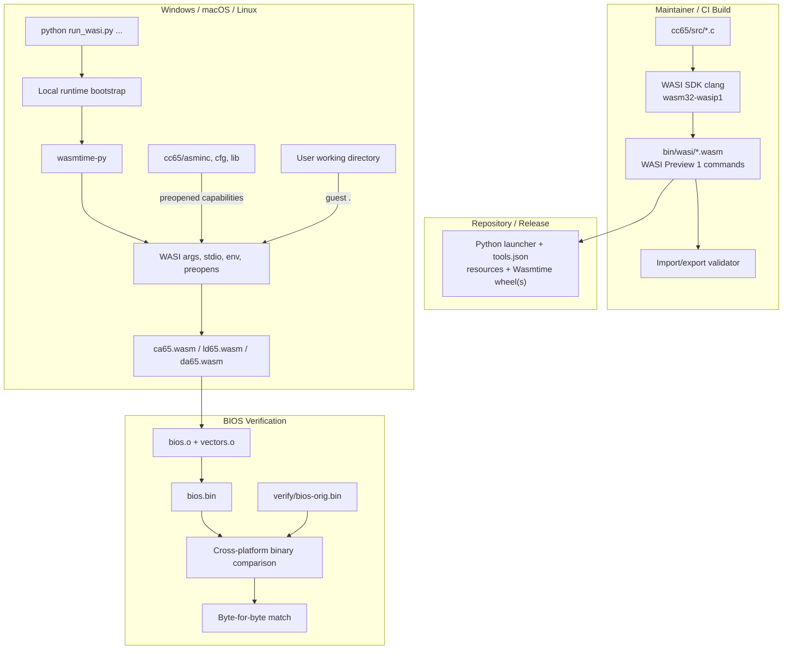

# Build cc65 as Standard WASI Tools — Detailed Build, Runtime, and Distribution Plan

## Goal

Compile the cc65 host tools (`ca65`, `ld65`, `da65`, and later the rest of the suite) as **standard WASI Preview 1 command modules**, run them through a small Python launcher using embedded Wasmtime, rebuild the Atari BIOS, and verify a byte-for-byte match against [`verify/bios-orig.bin`](verify/bios-orig.bin).

The finished repository should support this end-user workflow on Windows, macOS, and Linux:

```text
git clone <repository>
cd <repository>
python run_wasi.py ca65 --version
python run_wasi.py ca65 ...
python run_wasi.py ld65 ...
```

End users must not need a C compiler, WASI SDK, Emscripten, Node.js, Make, or the Wasmtime command-line program. Build tools are maintainer-only dependencies. The repository or release package contains the finished `.wasm` modules and everything the Python launcher needs.

---

## Architectural decisions

1. **Compile directly for WASI.** Use WASI SDK Clang targeting `wasm32-wasip1`; do not use Emscripten.
2. **Produce command modules.** Each executable exports `_start` and imports operating-system services from `wasi_snapshot_preview1`.
3. **Use Wasmtime from Python.** The launcher embeds `wasmtime-py`; it does not shell out to `wasmtime run`.
4. **Use WASI filesystem capabilities.** Host directories are explicitly preopened for the guest. No Python syscall emulation is used.
5. **Keep tool-specific behavior declarative.** Module paths, resource mounts, and environment variables live in [`tools.json`](tools.json), not in custom Python branches.
6. **Build once, run everywhere.** The `.wasm` files are platform-neutral. CI tests the same modules with Python on Windows, macOS, and Linux.
7. **Pin the toolchain and runtime.** WASI SDK and `wasmtime-py` versions are fixed and upgraded deliberately.
8. **Maintain a minimal WASI portability patch set.** cc65 remains ordinary portable C, but host-tool assumptions that have no meaningful WASI equivalent—such as executable-path discovery or process IDs—are handled by small, reviewable source patches or official `wasi-libc` emulation libraries, never by a Python syscall layer.

---

## Workspace layout

All paths are relative to `/home/jjs/Projects/atari800/zwasmexp` during the initial Linux development work. Runtime code must not depend on that absolute path.

| Path | Purpose |
|------|---------|
| [`cc65/`](cc65/) | Full cc65 v2.19 source tree and runtime resources |
| [`cc65/src/`](cc65/src/) | C source for the host tools |
| [`cc65/asminc/`](cc65/asminc/) | Assembly include files read by `ca65.wasm` at runtime |
| [`cc65/cfg/`](cc65/cfg/) | Linker configuration files read by `ld65.wasm` at runtime |
| [`cc65/lib/`](cc65/lib/) | cc65 target libraries and objects, when required |
| [`bios/`](bios/) | BIOS project assembled and linked by the WASI tools |
| [`verify/bios-orig.bin`](verify/bios-orig.bin) | Golden 4 KB BIOS image |
| [`bin/wasi/`](bin/wasi/) | Finished WASI command modules |
| [`run_wasi.py`](run_wasi.py) | Generic Python launcher |
| [`tools.json`](tools.json) | Declarative tool registry and mount configuration |
| [`vendor/wheels/`](vendor/wheels/) | Optional local Wasmtime wheels for zero-setup/offline use |
| [`build/`](build/) | Maintainer-only build and validation scripts |
| [`tests/`](tests/) | Runtime, tool, BIOS, and packaging tests |

---

## Phase A — Establish the WASI build contract

### A1. Preserve cc65 target resources exactly

The directory [`cc65/asminc/`](cc65/asminc/) contains **6502 assembly definitions**, not host C headers. Files such as `time.inc`, `stat.inc`, and `fcntl.inc` describe target-machine interfaces and data structures.

They must not be replaced, rewritten, or “corrected” for Unix, Windows, WASI, or POSIX. The WASI compiler builds only the host-tool C source under [`cc65/src/`](cc65/src/). The finished tools read `asminc`, `cfg`, and possibly `lib` as runtime data.

### A2. Pin and verify WASI SDK

Use a pinned WASI SDK release on maintainer machines and in CI.

Expected tools:

```text
<WASI_SDK_PATH>/bin/clang
<WASI_SDK_PATH>/bin/llvm-ar
<WASI_SDK_PATH>/bin/llvm-ranlib
<WASI_SDK_PATH>/share/wasi-sysroot
```

Canonical target:

```text
wasm32-wasip1
```

Do not rely on the compiler’s implicit default target. Pass the target and sysroot explicitly during both compilation and linking.

Example environment:

```bash
export WASI_SDK_PATH=/opt/wasi-sdk
export WASI_TARGET=wasm32-wasip1
```

### A3. Define the module acceptance contract

Every executable placed in [`bin/wasi/`](bin/wasi/) must satisfy all of the following:

- It is a core WebAssembly command module.
- It exports `_start`.
- Its host-service imports come from `wasi_snapshot_preview1`.
- It does not import Emscripten runtime functions from `env`, `js`, or similar modules.
- It does not require JavaScript glue.
- It runs without a custom Python syscall layer.
- It performs normal file I/O only through directories explicitly preopened by the runtime.

The build must fail if a module violates this contract.

### A4. Choose stable guest resource paths

Host installation paths vary across operating systems. Guest paths should therefore be stable and independent of the checkout location.

Use these guest-visible locations:

| Resource | Guest path |
|----------|------------|
| User’s invocation directory | `.` |
| cc65 assembly includes | `/cc65/asminc` |
| cc65 linker configs | `/cc65/cfg` |
| cc65 libraries | `/cc65/lib` |

At runtime, the Python launcher maps repository directories to those guest paths. The C programs never need to know whether the repository is on `C:\`, `/Users/...`, or `/home/...`.

### A5. Configure cc65 search paths through Make variables

The cc65 `src/Makefile` constructs its own `-DCA65_INC`, `-DLD65_CFG`, and related compiler definitions **after** `$(USER_CFLAGS)`. Therefore, placing duplicate `-D...` options in `USER_CFLAGS` is not reliable: the Makefile's later definitions become the effective values.

Set the Make variables that feed those definitions instead:

| Make variable | WASI guest value |
|---------------|------------------|
| `CA65_INC` | `/cc65/asminc` |
| `CC65_INC` | `/cc65/include` |
| `CL65_TGT` | `/cc65/target` |
| `LD65_CFG` | `/cc65/cfg` |
| `LD65_LIB` | `/cc65/lib` |
| `LD65_OBJ` | `/cc65/lib` |
| `BUILD_ID` | `WASI 2.19` |

The Makefile performs the C-string quoting itself. The build invocation should therefore pass plain path values:

```bash
make -C "$CC65_ROOT/src" \
    CA65_INC=/cc65/asminc \
    CC65_INC=/cc65/include \
    CL65_TGT=/cc65/target \
    LD65_CFG=/cc65/cfg \
    LD65_LIB=/cc65/lib \
    LD65_OBJ=/cc65/lib \
    BUILD_ID="WASI 2.19" \
    ...
```

Environment variables may still override or supplement these defaults where cc65 supports them, but the normal launcher should not depend on empty variables to neutralize build-host paths.

### A6. Resolve known WASI portability calls before the main build

Two cc65 host-side assumptions require an explicit policy before Phase B:

#### Executable-path discovery and `realpath()`

`src/common/searchpath.c` derives resource directories from `argv[0]` and calls `realpath()` as part of `AddSubSearchPathFromBin()`. That behavior is unnecessary in this distribution because resource locations are already fixed guest paths and explicitly preopened by the launcher.

Maintain a small patch under `patches/cc65-wasi/` that makes `AddSubSearchPathFromBin()` a no-op when compiling for WASI and excludes the POSIX executable-discovery helper code under `__wasi__`. This avoids depending on the guest executable appearing as a normal file or on a particular WASI SDK's `realpath`/current-directory behavior.

The patch must affect only the host tools. It must not touch `cc65/asminc/`, target headers, target libraries, or 6502 runtime behavior.

#### `getpid()`

WASI Preview 1 has no process-ID syscall. WASI SDK/wasi-libc provides the optional static library `libwasi-emulated-getpid.a`, whose implementation returns a fixed synthetic value. Link it explicitly for the first successful build:

```text
-lwasi-emulated-getpid
```

Then identify every cc65 call site and test its purpose. If a call uses the PID merely for diagnostics, the emulation library is sufficient. If it contributes to temporary-file uniqueness, replace that use with a WASI-safe strategy before enabling parallel tool invocations, because a constant synthetic PID cannot distinguish concurrent instances.

Do not implement `getpid()` in Python and do not add a nonstandard runtime import.

### A7. Record reproducibility behavior

`ca65` calls `time(0)` and stores a timestamp in its object output. Therefore:

- Native and WASI `.o` files may differ even when semantically equivalent.
- The final raw BIOS image is expected to remain identical if `ld65` does not propagate the timestamp.
- The primary acceptance test is the final `bios.bin` comparison.

If deterministic intermediate objects become a requirement, add explicit `SOURCE_DATE_EPOCH` support in a small, documented cc65 patch rather than introducing Emscripten-specific environment behavior.

---

## Phase B — Build cc65 with WASI SDK

### B1. Create [`build/build_cc65_wasi.sh`](build/build_cc65_wasi.sh)

The build script is for maintainers and CI only.

```bash
#!/usr/bin/env bash
set -euo pipefail

SCRIPT_DIR="$(cd -- "$(dirname -- "$0")" && pwd)"
PROJECT_ROOT="$(cd -- "$SCRIPT_DIR/.." && pwd)"

WASI_SDK_PATH="${WASI_SDK_PATH:-/opt/wasi-sdk}"
WASI_TARGET="${WASI_TARGET:-wasm32-wasip1}"
WASI_SYSROOT="$WASI_SDK_PATH/share/wasi-sysroot"

CLANG="$WASI_SDK_PATH/bin/clang"
LLVM_AR="$WASI_SDK_PATH/bin/llvm-ar"
LLVM_RANLIB="$WASI_SDK_PATH/bin/llvm-ranlib"

CC65_ROOT="$PROJECT_ROOT/cc65"
OUTPUT_DIR="$PROJECT_ROOT/bin/wasi"

for tool in "$CLANG" "$LLVM_AR" "$LLVM_RANLIB"; do
    if [[ ! -x "$tool" ]]; then
        echo "ERROR: Required WASI SDK tool not found: $tool" >&2
        exit 1
    fi
done

if [[ ! -d "$WASI_SYSROOT" ]]; then
    echo "ERROR: WASI sysroot not found: $WASI_SYSROOT" >&2
    exit 1
fi

echo "=== Building cc65 as WASI Preview 1 commands ==="
echo "Target: $WASI_TARGET"
echo "Clang: $($CLANG --version | head -n 1)"

make -C "$CC65_ROOT/src" clean 2>/dev/null || true
rm -rf "$CC65_ROOT/wrk" "$CC65_ROOT/bin"
rm -rf "$OUTPUT_DIR"
mkdir -p "$OUTPUT_DIR"

# Apply the maintained WASI portability patches before compiling.
"$PROJECT_ROOT/build/apply_cc65_wasi_patches.sh"

make -C "$CC65_ROOT/src" \
    CC="$CLANG" \
    AR="$LLVM_AR" \
    RANLIB="$LLVM_RANLIB" \
    EXE_SUFFIX=".wasm" \
    CA65_INC=/cc65/asminc \
    CC65_INC=/cc65/include \
    CL65_TGT=/cc65/target \
    LD65_CFG=/cc65/cfg \
    LD65_LIB=/cc65/lib \
    LD65_OBJ=/cc65/lib \
    BUILD_ID="WASI 2.19" \
    USER_CFLAGS="--target=$WASI_TARGET --sysroot=$WASI_SYSROOT -O3" \
    LDFLAGS="--target=$WASI_TARGET --sysroot=$WASI_SYSROOT" \
    LDLIBS="-lm -lwasi-emulated-getpid" \
    ca65 ld65 da65

for tool in ca65 ld65 da65; do
    source_file="$CC65_ROOT/bin/$tool.wasm"
    destination="$OUTPUT_DIR/$tool.wasm"

    if [[ ! -f "$source_file" ]]; then
        echo "ERROR: Expected build output was not created: $source_file" >&2
        exit 1
    fi

    cp "$source_file" "$destination"
done

"$PROJECT_ROOT/build/verify_wasi_modules.py" "$OUTPUT_DIR"/*.wasm

ls -lh "$OUTPUT_DIR"
echo "=== WASI build complete ==="
```

### B2. Treat the script as a template until the first build

The first WASI build must confirm the emitted compiler and linker commands, especially:

- the Makefile-generated resource-path definitions;
- `USER_CFLAGS` target/sysroot propagation;
- `LDFLAGS` target/sysroot propagation;
- `LDLIBS` ordering and inclusion of `-lwasi-emulated-getpid`;
- `EXE_SUFFIX`;
- `RANLIB` behavior.

Fail the build if the compiler command contains duplicate resource-path macros or any build-host installation path. Do not fall back to Emscripten because a Make variable needs adjustment.

### B3. Build only the initial tool set

Start with:

```text
ca65
ld65
da65
```

After the runtime and BIOS verification pass, add the remaining cc65 executables using the same module contract.

### B4. Validate imports and exports automatically

Create [`build/verify_wasi_modules.py`](build/verify_wasi_modules.py) or an equivalent maintainer-side validator.

For every module, verify:

```text
Required export:
    _start

Allowed host import module:
    wasi_snapshot_preview1

Rejected import modules:
    env
    js
    emscripten
```

The validator may use a pinned inspection library or a maintainer-only WebAssembly utility. It is not part of the end-user runtime.

### B5. Smoke-test the modules before Python integration

On the build machine, an optional maintainer smoke test may use the Wasmtime CLI:

```bash
wasmtime run --dir . --dir cc65/asminc::/cc65/asminc \
    bin/wasi/ca65.wasm -- --version
```

This is diagnostic only. The supported end-user path is the Python launcher.

---

## Phase C — Build a generic embedded Python WASI runner

### C1. Replace [`run_cc65.py`](run_cc65.py) with [`run_wasi.py`](run_wasi.py)

Interface:

```text
python run_wasi.py <tool> [tool arguments...]
```

Examples:

```bash
python run_wasi.py ca65 --version
python run_wasi.py ca65 src/bios.asm -o build/bios.o
python run_wasi.py ld65 -C bios.cfg build/bios.o -o bios.bin
```

The runner must:

1. Resolve `<tool>` through [`tools.json`](tools.json).
2. Load `bin/wasi/<tool>.wasm` with `wasmtime-py`.
3. Configure WASI arguments, environment, standard streams, and preopened directories.
4. Invoke the module’s `_start` export.
5. Convert WASI `proc_exit` into the launcher’s process exit code.
6. Report traps and configuration failures clearly.

The runner must not:

- Implement `openat`, `stat`, `read`, `write`, or other guest syscalls.
- Read or write guest linear memory to construct `argv`.
- Call guest `malloc`.
- emulate Emscripten `env::*` imports.
- invoke Node.js.
- require the Wasmtime command-line executable.

### C2. Use a standard-library configuration file

Use JSON so Python 3.9+ can parse it without another dependency.

Example [`tools.json`](tools.json):

```json
{
  "schema_version": 1,
  "tools": {
    "ca65": {
      "module": "bin/wasi/ca65.wasm",
      "mounts": [
        {"host": "cc65/asminc", "guest": "/cc65/asminc"}
      ],
      "environment": {
        "CA65_INC": "/cc65/asminc"
      }
    },
    "ld65": {
      "module": "bin/wasi/ld65.wasm",
      "mounts": [
        {"host": "cc65/cfg", "guest": "/cc65/cfg"},
        {"host": "cc65/lib", "guest": "/cc65/lib", "optional": true}
      ],
      "environment": {
        "LD65_CFG": "/cc65/cfg",
        "LD65_LIB": "/cc65/lib",
        "LD65_OBJ": "/cc65/lib"
      }
    },
    "da65": {
      "module": "bin/wasi/da65.wasm",
      "mounts": []
    }
  }
}
```

The compile-time paths and environment variables intentionally agree. This makes the resource layout explicit and provides compatibility with cc65’s environment-based overrides.

### C3. Define filesystem access

For every invocation:

- Preopen the caller’s current directory as guest `.` with read/write access.
- Preopen only the configured repository resources for the selected tool.
- Do not expose the entire repository, home directory, or filesystem by default.
- Resolve all host paths from `Path(__file__).resolve().parent`, never from a hard-coded Linux path.

This arrangement preserves ordinary relative command-line paths from Make while keeping resource paths stable.

### C4. Embed Wasmtime through Python

The runner’s core should remain close to the standard WASI lifecycle:

```python
engine = Engine()
store = Store(engine)

wasi = WasiConfig()
wasi.argv = [tool_name, *tool_args]
wasi.inherit_stdin()
wasi.inherit_stdout()
wasi.inherit_stderr()
wasi.env = list(environment.items())
wasi.preopen_dir(str(Path.cwd()), ".")

for mount in mounts:
    wasi.preopen_dir(str(mount.host_path), mount.guest_path)

store.set_wasi(wasi)

linker = Linker(engine)
linker.define_wasi()

module = Module.from_file(engine, str(module_path))
instance = linker.instantiate(store, module)
instance.exports(store)["_start"](store)
```

The exact exception and exit-status handling must be implemented against the pinned `wasmtime-py` version and covered by tests.

### C5. Make the Python dependency self-bootstrapping

Pin `wasmtime-py` to a tested version. Do not use an unbounded dependency because its major version changes frequently and may include API changes.

Recommended loader order:

1. Try importing the repository-local runtime package.
2. If absent, select a compatible wheel from [`vendor/wheels/`](vendor/wheels/).
3. Install it into a private directory such as `.runtime/site-packages` using the current Python interpreter.
4. Restart or extend `sys.path`, then run the tool.
5. Optionally permit an online fallback to the pinned package when no local wheel exists.

For the literal “download, have Python installed, and go” requirement, release packages must include compatible Wasmtime wheels or otherwise bundle the runtime dependency. A network-only `pip install` is convenient but is not a fully self-contained distribution.

### C6. Supported initial Python/platform matrix

Initial target:

```text
64-bit Python 3.9+
Windows x86-64
Windows ARM64, when CI and wheel coverage are available
macOS x86-64
macOS ARM64
Linux x86-64
Linux ARM64
```

The exact supported combinations must match the pinned Wasmtime wheel set included in releases.

### C7. Runner tests

Create tests for:

- Unknown tool name.
- Missing module.
- Missing configured resource directory.
- Optional resource directory absent.
- Standard output and standard error forwarding.
- Non-zero guest exit status.
- Invalid module lacking `_start`.
- Module with unsupported imports.
- Relative input and output paths.
- Invocation from a directory containing spaces.
- Unicode host paths where supported.
- Concurrent or repeated invocations.

---

## Phase D — Migrate the BIOS Makefile without absolute paths

### D1. Define repository-relative tool commands

Replace native commands with the generic launcher while preserving overridability:

```makefile
PYTHON ?= python3
PROJECT_ROOT := $(abspath ..)
RUN_WASI := $(PYTHON) $(PROJECT_ROOT)/run_wasi.py

CA65 := $(RUN_WASI) ca65
LD65 := $(RUN_WASI) ld65
DA65 := $(RUN_WASI) da65
```

Do not embed `/home/jjs/...` or a virtual-environment path in the Makefile.

### D2. Keep existing assembler and linker arguments

Existing tool flags and build rules should remain unchanged unless a genuine WASI path-resolution issue is observed.

Example:

```makefile
CA65_FLAGS = --cpu 6502 --debug-info
```

The launcher preopens the Make process’s current directory as guest `.`, so relative source, object, config, and output paths should continue to work naturally.

### D3. Preserve native-tool override capability

Where practical, keep a simple switch for comparison testing:

```makefile
USE_NATIVE_CC65 ?= 0

ifeq ($(USE_NATIVE_CC65),1)
CA65 := ca65
LD65 := ld65
DA65 := da65
else
CA65 := $(RUN_WASI) ca65
LD65 := $(RUN_WASI) ld65
DA65 := $(RUN_WASI) da65
endif
```

This is useful for differential testing and does not affect end-user WASI operation.

---

## Phase E — Build and verify the BIOS

### E1. Smoke tests

```bash
python run_wasi.py ca65 --version
python run_wasi.py ca65 --help
python run_wasi.py ld65 --version
python run_wasi.py da65 --version
```

Acceptance criteria:

- No unresolved imports.
- No Emscripten compatibility messages.
- Correct output streams.
- Correct exit codes.

### E2. Clean BIOS build

```bash
cd bios
make clean
make
```

### E3. Byte-for-byte verification

On Unix-like development systems:

```bash
cmp -l bios.bin ../verify/bios-orig.bin
```

Cross-platform Python verifier:

```bash
python ../tests/compare_binary.py bios.bin ../verify/bios-orig.bin
```

Expected result:

```text
Files are identical.
```

The Python verifier should report:

- File sizes.
- First differing offset.
- A short hexadecimal window around the first difference.
- A non-zero exit status on mismatch.

### E4. Diagnostic sequence on mismatch

1. Confirm both tools report the expected cc65 version and `BUILD_ID`.
2. Compare native and WASI assembler command lines.
3. Confirm the same source and include files were opened.
4. Compare object-file structure while accounting for timestamps.
5. Compare linker config resolution.
6. Compare map files, label files, and segment placement.
7. Locate the first final-image difference.
8. Confirm the maintained `searchpath.c` WASI patch is active and inspect any `getpid()`-dependent behavior.
9. Patch only verified portability problems; do not add generic syscall emulation.

### E5. Reproducible objects, if required

If object-level reproducibility becomes an explicit requirement, patch `ca65` to honor `SOURCE_DATE_EPOCH`:

```c
const char* source_date_epoch = getenv("SOURCE_DATE_EPOCH");
if (source_date_epoch != 0) {
    OptDateTime((unsigned long)strtoul(source_date_epoch, 0, 10));
} else {
    OptDateTime((unsigned long)time(0));
}
```

Document this as a small portability/reproducibility patch maintained separately from the WASI runtime.

---

## Phase F — Expand from cc65 to the wider C tool suite

### F1. Apply one onboarding checklist to every program

For each new C command-line program:

1. Build with the pinned WASI SDK target.
2. Confirm `_start` is exported.
3. Reject non-WASI imports.
4. Identify required read-only resources.
5. Add one [`tools.json`](tools.json) entry.
6. Add smoke tests and a representative end-to-end test.
7. Verify output against the native version where deterministic comparison is possible.
8. Document any real WASI portability patch in the program’s patch directory.

### F2. Do not add compatibility code preemptively

If a program fails to compile or run, classify the failure first:

- Missing or differently specified POSIX API.
- Process spawning (`fork`, `exec`, shell commands).
- Dynamic library loading.
- Terminal-specific behavior.
- Filesystem capability or path assumption.
- Locale, timezone, or clock behavior.
- Network dependency.
- Platform-specific source code.

Prefer a small source-level portability change or a feature-disable build option. Add a host import only when the suite deliberately defines a reusable extension beyond standard WASI.

### F3. Keep the generic runner generic

Adding a new ordinary WASI program should usually require:

```text
one .wasm file
one tools.json entry
resource files, if any
tests
```

It should not require a new Python syscall implementation.

---

## Phase G — Package for Windows, macOS, and Linux

### G1. Build the WebAssembly tools once

CI builds the `.wasm` modules once using the pinned WASI SDK. Those exact files are then tested on every host operating system.

Do not rebuild the C tools separately for Windows, macOS, and Linux. Cross-platform consistency is one of the reasons to use WASI.

### G2. Test the Python runtime matrix

For every supported platform/architecture combination:

1. Start from a clean checkout or release archive.
2. Use only the installed Python interpreter.
3. Bootstrap the repository-local Wasmtime package.
4. Run tool version tests.
5. Assemble and link the BIOS.
6. Compare the resulting BIOS with the golden file.
7. Confirm no compiler, Make, Node.js, Wasmtime CLI, or system package is used by the runtime path.

### G3. Choose the release form

Two supported release strategies are reasonable:

#### Universal repository/archive

Include wheels for all supported platforms in [`vendor/wheels/`](vendor/wheels/). This gives one download at the cost of a larger archive.

#### Platform-specific release archives

Publish separate archives containing the common repository plus only the matching Wasmtime wheel:

```text
suite-windows-x86_64.zip
suite-windows-arm64.zip
suite-macos-x86_64.zip
suite-macos-arm64.zip
suite-linux-x86_64.tar.gz
suite-linux-arm64.tar.gz
```

The source repository may use online bootstrap for developers while release archives provide the strict self-contained experience.

### G4. End-user acceptance test

On a clean supported machine:

```text
1. Install supported 64-bit Python.
2. Download or clone the suite.
3. Run: python run_wasi.py ca65 --version
4. Build the BIOS or another sample project.
```

No manual dependency installation should be required.

---

## Files to create or modify

| File | Action | Description |
|------|--------|-------------|
| [`build/build_cc65_wasi.sh`](build/build_cc65_wasi.sh) | **Create** | Compile cc65 with pinned WASI SDK |
| [`build/verify_wasi_modules.py`](build/verify_wasi_modules.py) | **Create** | Enforce import/export contract |
| [`build/apply_cc65_wasi_patches.sh`](build/apply_cc65_wasi_patches.sh) | **Create** | Apply the pinned, idempotent cc65 WASI patch set |
| [`patches/cc65-wasi/searchpath-no-exe-discovery.patch`](patches/cc65-wasi/searchpath-no-exe-discovery.patch) | **Create** | Disable `argv[0]`/`realpath()` resource discovery under WASI |
| [`run_wasi.py`](run_wasi.py) | **Create** | Generic embedded Wasmtime launcher |
| [`bootstrap_runtime.py`](bootstrap_runtime.py) | **Create** | Install/load pinned local Wasmtime wheel |
| [`tools.json`](tools.json) | **Create** | Tool modules, mounts, and environment |
| [`requirements-runtime.txt`](requirements-runtime.txt) | **Create** | Pinned `wasmtime-py` version for development/bootstrap |
| [`vendor/wheels/`](vendor/wheels/) | **Populate for releases** | Supported Wasmtime wheels |
| [`bios/Makefile`](bios/Makefile) | **Modify** | Replace native commands with repo-relative launcher calls |
| [`tests/compare_binary.py`](tests/compare_binary.py) | **Create** | Cross-platform byte comparator |
| [`tests/test_runner.py`](tests/test_runner.py) | **Create** | Generic launcher tests |
| [`tests/test_cc65_pipeline.py`](tests/test_cc65_pipeline.py) | **Create** | Assemble/link/verify integration test |
| [`PLAN-PROGRESS.md`](PLAN-PROGRESS.md) | **Create** | Implementation checklist and observed results |

The existing Emscripten-oriented [`build_wasm_wasi.sh`](build_wasm_wasi.sh) and custom-syscall [`run_cc65.py`](run_cc65.py) should be retained only temporarily for comparison, then archived or removed after the standard WASI pipeline passes all acceptance tests.

---

## Architecture diagram



---

## Risks and mitigations

| Risk | Impact | Mitigation |
|------|--------|------------|
| `USER_CFLAGS` path macros are overwritten by later Makefile definitions | Modules contain unusable build-host paths | Set `CA65_INC`, `CC65_INC`, `CL65_TGT`, `LD65_CFG`, `LD65_LIB`, `LD65_OBJ`, and `BUILD_ID` as Make variables; reject duplicate macros |
| `realpath()`/`argv[0]` executable discovery is unavailable or semantically unsuitable | Compile, link, or resource-discovery failure | Apply the WASI-only `AddSubSearchPathFromBin()` no-op patch and use fixed preopened guest paths |
| `getpid()` has no WASI Preview 1 syscall | Link failure or unsafe uniqueness assumptions | Link `-lwasi-emulated-getpid`; audit call sites and patch any temporary-name use before parallel execution |
| Module accidentally retains Emscripten imports | Reintroduces custom runtime requirements | Fail the build through import validation |
| Relative paths behave differently under preopens | Input or output files not found | Preopen invocation CWD as guest `.`; test nested and spaced paths on all hosts |
| Absolute Unix paths leak into binaries | Modules fail outside the build host | Use stable guest paths only; scan strings/import metadata during CI |
| Timestamp differences alter intermediate objects | Native/WASI `.o` mismatch | Compare final image first; add `SOURCE_DATE_EPOCH` support only if required |
| Wasmtime Python API changes | Launcher breaks after dependency update | Pin the package; upgrade deliberately with CI coverage |
| Wasmtime wheel unavailable for a Python/platform combination | Bootstrap failure | Publish an explicit support matrix and include only verified wheels |
| Release requires network access | Violates self-contained goal | Vendor wheels or publish platform-specific archives |
| Overly broad preopened directories | Unnecessary host filesystem exposure | Mount CWD and declared resources only |
| A future tool requires processes, dynamic libraries, or host-specific devices | Not representable as an ordinary WASI command | Document the limitation; port the feature or define an explicit suite extension |

---

## Completion criteria

The migration is complete when all of the following are true:

- `ca65.wasm`, `ld65.wasm`, and `da65.wasm` are built directly with WASI SDK.
- Each module exports `_start`.
- Each module’s host imports are accepted by the WASI module validator.
- The Python runtime contains no Emscripten syscall emulation.
- The runtime does not require Node.js or the Wasmtime CLI.
- Tool resources are accessed through declared preopened directories.
- The module contains the intended `/cc65/...` resource defaults and no build-host paths.
- The WASI search-path patch is applied, and no runtime behavior depends on locating resources beside the executable.
- Every `getpid()` call site has been classified; any uniqueness-sensitive use has been replaced rather than relying on the fixed emulated PID.
- The BIOS builds successfully through `python run_wasi.py`.
- The generated BIOS is byte-for-byte identical to the golden image.
- The same `.wasm` modules pass on Windows, macOS, and Linux.
- A clean end user can download the package, use an installed supported Python, and run the suite without manually installing additional tools.
