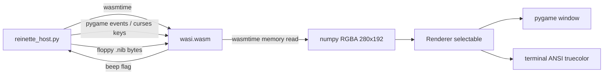

# Python Host Plan: Reinette II+ (headless WASI framebuffer)

## Goal

Finish the WASI port so that [`reinette-wasi.c`](../reinette-wasi.c) runs headless
(no SDL2) and renders into a raw 280x192 RGBA framebuffer in WASM linear memory.
A Python host loads `wasi.wasm` with wasmtime, drives the emulator at ~60 Hz,
and displays the framebuffer with either a pygame window or a terminal renderer
(selectable at runtime).

## Current State (verified)

- [`reinette-wasi.c`](../reinette-wasi.c:1) is **already converted**: no SDL2 code,
  pure-WASI, 280x192 RGBA `g_fb[]`, embedded fonts ([`wasi_fonts.h`](../wasi_fonts.h))
  and ROMs ([`wasi_roms.h`](../wasi_roms.h)).
- Exported API: `wasi_init`, `wasi_tick`, `wasi_keydown`, `wasi_keyup`,
  `wasi_fb_ptr`, `wasi_fb_width`, `wasi_fb_height`, `wasi_beep_pending`,
  `wasi_ack_beep`, `wasi_insertFloppy`.
- [`Makefile.wasi`](../Makefile.wasi) already builds `wasi.wasm` (STANDALONE_WASM)
  with those exports.
- **Missing**: Python host script (none exists).
- **Temp files to remove**: `jj/font_norm.h`, `jj/font_normal_array.c`,
  `jj/font_rev.h`, `jj/font_reverse_array.c` (unreferenced; data duplicated in
  `wasi_fonts.h`).
- **Stale artifacts**: `wasi.js`, `wasi.data` from the old SDL/preload build.

## Architecture

## Renderer Selection

`--renderer pygame|terminal` (default `pygame`). Detected at startup; a missing
pygame falls back to terminal with a warning.

### Pygame Renderer
- `pygame.display.set_mode` with integer scaling (default 3x -> 840x576).
- `pygame.surfarray` or `pygame.image.frombuffer` RGBA -> surface, blit scaled.
- Keyboard: `pygame.event.key` values are already SDL scancode-keycodes that
  map directly to the `SDLK_*` constants in [`reinette-wasi.c`](../reinette-wasi.c:47).
  Forward `KEYDOWN`->`wasi_keydown`, `KEYUP`->`wasi_keyup`.
- F10 = pause, F11 = reset (already implemented in C).
- Floppy: drag-and-drop file or `--floppy` CLI arg -> `wasi_insertFloppy`.
- Beep: poll `wasi_beep_pending`/`wasi_ack_beep` each frame; play short beep via
  `pygame.mixer` (optional, failure-tolerant).

### Terminal Renderer
- `curses.wrapper`, ANSI 24-bit color (`\x1b[38;2;R;G;Bm`) + half-block glyphs
  `▀`/`▄` for 2 vertical pixels per cell -> 140x96 terminal cells.
- Keyboard via `curses` `get_wch`/keypad, mapped to the same SDLK values the C
  side expects (a-z, 0-9, arrows, F-keys, Enter, Backspace, Escape).
- Beep via terminal bell (`\a`) when `wasi_beep_pending`.

## File Changes

1. **Delete** temp `jj/` font files (4 files).
2. **`Makefile.wasi`** — extend `clean` to remove `wasi.js`, `wasi.data`.
3. **Delete** stale `wasi.js`, `wasi.data` (or covered by clean).
4. **New: `reinette_host.py`** (in repo root, next to `wasi.wasm`):
   - wasmtime loader (mirrors `_get_wasmtime` bootstrap pattern from
     [`bin/run_wasi.py`](../../../bin/run_wasi.py), but instantiates directly and
     uses the exported `_*` functions, not `_start`).
   - `Emulator` class wrapping init/tick/key/fb/beep/floppy calls.
   - `read_framebuffer()` -> `numpy` (or `array`) RGBA via `memory.read(store, ptr, n)`.
   - Renderer dispatch + 60 Hz main loop (`wasi_tick()` + `wasi_key*` + `wasi_fb*`).
   - CLI: `--renderer`, `--scale`, `--floppy`, `--fps`.
5. **`plans/wasi-port-plan.md`** — update to reflect the actual headless design
   (remove SDL2/preload-file assumptions, document framebuffer API + Python host).

## Verification

- `make wasi` builds `wasi.wasm`.
- `wasm-objdump -x wasi.wasm` shows the 10 exported `wasi_*` functions.
- `python3 reinette_host.py --floppy 'DOS 3.3.nib' --renderer terminal` boots to
  the DOS 3.3 prompt in the terminal.
- pygame path verified interactively (or via screenshot when display available).

## Open Questions

- pygame may not be installed; confirm `pip install pygame wasmtime` is acceptable.
- Terminal keycodes for Ctrl/Shift combos rely on curses `KEY_*`; exact Apple II
  modifier mapping may need minor tweaks after first run.
