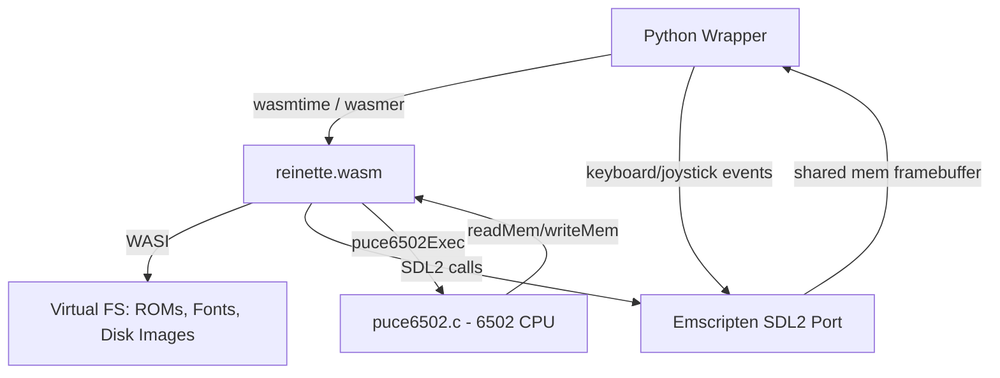
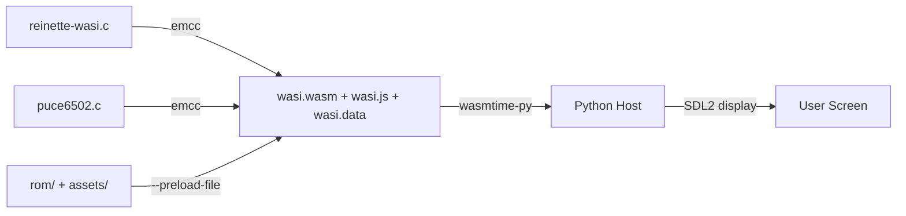

# WASI Port Plan: Reinette II+

## Overview

Port [`reinette-wasi.c`](../reinette-wasi.c) (Apple II emulator) to compile as a WASI-compatible WebAssembly module using Emscripten, retaining SDL2 for graphics/input, with a Python host wrapper.

**Compiler**: Emscripten `emcc` at `/home/jjs/emsdk/upstream/emscripten/emcc`  
**Activation**: `source /home/jjs/emsdk/emsdk_env.sh` before building

---

## Architecture



### Key Design Decisions

| Decision | Choice | Rationale |
|----------|--------|-----------|
| Compiler | Emscripten `emcc` | Only practical way to get SDL2 in WASM; already installed |
| WASM flavor | `-sSTANDALONE_WASM` | WASI-compatible, runnable via wasmtime from Python |
| SDL2 | `-sUSE_SDL=2` | Emscripten's built-in SDL2 port; no separate compilation |
| Main loop | `emscripten_set_main_loop` | Replaces `while(running)`; required for WASM event model |
| Assets | `--preload-file` at build time | ROMs and fonts bundled into WASM module as virtual FS |
| Disk images | WASI preopened directories | `.nib` files loaded/saved via WASI `fopen`/`fwrite` |
| Audio | Minimal beep via SDL audio | SDL audio queue with single square-wave beep; no ring buffer |
| Memory | `-sINITIAL_MEMORY=128MB` | Needs ~64MB for emulator state + 2x 233KB disk images |

---

## File-by-File Changes

### 1. `Makefile.wasi` (NEW)

```makefile
# Paths
EMSDK_DIR = $(HOME)/emsdk
EMCC = $(EMSDK_DIR)/upstream/emscripten/emcc

# Flags
WASI_FLAGS = -sSTANDALONE_WASM=1 \
             -sUSE_SDL=2 \
             -sINITIAL_MEMORY=134217728 \
             -sALLOW_MEMORY_GROWTH=0 \
             -sEXPORTED_FUNCTIONS='["_main"]' \
             -sEXPORTED_RUNTIME_METHODS='["ccall","cwrap"]' \
             -sENVIRONMENT=web,worker,node \
             --preload-file rom/@rom/ \
             --preload-file assets/@assets/ \
             -O3 \
             -std=c11

CFLAGS = -Wall -Wno-pedantic

wasi: reinette-wasi.c puce6502.c
	$(EMCC) $^ $(WASI_FLAGS) $(CFLAGS) -o $@.js

# Generates: wasi.js + wasi.wasm + wasi.data
```

**Key flags explained**:
- `-sSTANDALONE_WASM=1`: Produces WASI-compatible WASM (no JS glue needed for wasmtime)
- `-sUSE_SDL=2`: Links Emscripten's SDL2 port
- `-sINITIAL_MEMORY=134217728` (128MB): Enough for 48KB RAM + 12KB ROM + 12KB LC + 2x233KB disks + framebuffer
- `--preload-file rom/@rom/`: Embeds `rom/` directory as `/rom/` in virtual FS
- `--preload-file assets/@assets/`: Embeds `assets/` as `/assets/` in virtual FS

### 2. `reinette-wasi.c` Changes

#### 2a. Add Emscripten includes (top of file)

```c
#ifdef __EMSCRIPTEN__
#include <emscripten.h>
#include <emscripten/html5.h>
#endif
```

#### 2b. Main loop adaptation

**Before** (lines 563-951):
```c
while (running) {
    if (!paused) {
        puce6502Exec(17050);
        for (tries = 0; disk[curDrv].motorOn && tries < 32; tries++)
            puce6502Exec(5000);
    }
    while (SDL_PollEvent(&event)) {
        // ... event handling ...
    }
    // ... video rendering ...
    SDL_RenderPresent(rdr);
}
```

**After**:
```c
#ifdef __EMSCRIPTEN__
// Emscripten main loop callback
static void emscriptenMainLoop(void *arg) {
    (void)arg;
    // Same logic as while-loop body, minus the SDL_Quit/cleanup
    if (!paused) {
        puce6502Exec(17050);
        for (tries = 0; disk[curDrv].motorOn && tries < 32; tries++)
            puce6502Exec(5000);
    }
    SDL_Event event;
    while (SDL_PollEvent(&event)) {
        // ... event handling (same as before) ...
        if (event.type == SDL_QUIT) {
            emscripten_cancel_main_loop();
            return;
        }
    }
    // ... video rendering (same as before) ...
    SDL_RenderPresent(rdr);
}
#endif
```

In `main()`:
```c
#ifdef __EMSCRIPTEN__
    emscripten_set_main_loop_arg(emscriptenMainLoop, NULL, 0, 1);
    // Never reaches here; cleanup handled differently
#else
    while (running) {
        // ... original loop ...
    }
    // cleanup
    SDL_Quit();
    return 0;
#endif
```

#### 2c. Asset path handling

**Problem**: Original code derives asset paths from `argv[0]` using Windows `\` separators.

**Fix**: When `__EMSCRIPTEN__` is defined, assets are at fixed virtual FS paths:
```c
#ifdef __EMSCRIPTEN__
    // Assets and ROMs are preloaded to fixed paths
    tmpSurface = SDL_LoadBMP("/assets/font-normal.bmp");
    // ...
    tmpSurface = SDL_LoadBMP("/assets/font-reverse.bmp");
    // ...
    f = fopen("/rom/appleII+.rom", "rb");
    // ...
    f = fopen("/rom/diskII.rom", "rb");
#else
    // Original argv[0]-based path logic
#endif
```

#### 2d. Disk image I/O

**Problem**: Disk `.nib` files are loaded/saved via `fopen`. In WASI, the filesystem is virtual; we need preopened directories for the host to provide disk images.

**Fix**: Keep `fopen`/`fread`/`fwrite` as-is since WASI handles these, but the Python wrapper must map a host directory to `/` in the WASI sandbox. Disk images would be passed as command-line arguments or loaded from a well-known path like `/disks/`.

Alternative: Add an exported function so Python can inject disk image data:
```c
#ifdef __EMSCRIPTEN__
#include <emscripten.h>

EMSCRIPTEN_KEEPALIVE
int wasi_insertFloppy(uint8_t *data, int size, int drive) {
    if (size != 232960) return 0;
    memcpy(disk[drive].data, data, 232960);
    disk[drive].readOnly = false; // or true, based on flags
    sprintf(disk[drive].filename, "disk%d.nib", drive);
    return 1;
}
#endif
```

#### 2e. Minimal beep audio

**Problem**: Original `playSound()` is a stub. Need a simple beep.

**Approach**: Use SDL audio with a simple queue:
```c
#ifdef __EMSCRIPTEN__
#include <SDL2/SDL_audio.h>

#define BEEP_FREQ     1000
#define BEEP_DURATION 100  // ms
#define BEEP_SAMPLES  (48000 * BEEP_DURATION / 1000)

static SDL_AudioDeviceID audioDevice = 0;
static int beepSamplesRemaining = 0;

static void audioCallback(void *userdata, Uint8 *stream, int len) {
    (void)userdata;
    Sint16 *buf = (Sint16 *)stream;
    int samples = len / sizeof(Sint16);
    for (int i = 0; i < samples; i++) {
        if (beepSamplesRemaining > 0) {
            // Simple square wave beep
            static int phase = 0;
            buf[i] = (phase < 24000 / BEEP_FREQ) ? 8000 : -8000;
            if (++phase >= 48000 / BEEP_FREQ) phase = 0;
            beepSamplesRemaining--;
        } else {
            buf[i] = 0;
        }
    }
}

static void playSound(void) {
    if (!audioDevice) return;
    beepSamplesRemaining = BEEP_SAMPLES;
}
#endif
```

Audio init in `main()`:
```c
#ifdef __EMSCRIPTEN__
    SDL_AudioSpec desired;
    SDL_zero(desired);
    desired.freq = 48000;
    desired.format = AUDIO_S16SYS;
    desired.channels = 1;
    desired.samples = 1024;
    desired.callback = audioCallback;
    audioDevice = SDL_OpenAudioDevice(NULL, 0, &desired, NULL, 0);
    if (audioDevice)
        SDL_PauseAudioDevice(audioDevice, 0);
#endif
```

### 3. `Makefile` Changes

Add a `wasi` target that sources emsdk and delegates:

```makefile
.PHONY: wasi
wasi:
	source $(HOME)/emsdk/emsdk_env.sh && \
	$(MAKE) -f Makefile.wasi wasi
```

Update `clean`:
```makefile
clean:
	rm -f reinetteII+
	rm -f wasi.js wasi.wasm wasi.data
```

---

## Python Wrapper Integration (Reference)

The Python host will use `wasmtime-py` (or similar) to:

```python
import wasmtime

# Configure WASI
config = wasmtime.Config()
config.wasi = True

# Map host directory for disk images
wasi_config = wasmtime.WasiConfig()
wasi_config.preopen_dir("/path/to/disks", "/disks")

# Load and run
engine = wasmtime.Engine(config)
module = wasmtime.Module.from_file(engine, "wasi.wasm")
linker = wasmtime.Linker(engine)
store = wasmtime.Store(engine)

# The WASM module's SDL2 will render to a shared memory buffer
# Python reads this buffer and displays via pygame/SDL2 bindings
instance = linker.instantiate(store, module)
instance.exports(store)["_main"](store)
```

---

## Build Flow



---

## Open Questions for Review

1. **Disk image loading**: Should disk `.nib` images be loaded via WASI filesystem (`fopen` from preopened dir), or via an exported C function that Python calls with raw bytes?

2. **Audio**: The minimal beep approach works for simple speaker clicks. Is the full audio system from `reinetteII+.c` needed later, or is beep-only sufficient?

3. **Memory sizing**: 128MB is generous. Can we measure and reduce? The emulator state is ~64KB RAM + ROMs + disk buffers. The main consumer is the Emscripten SDL2 framebuffer.

4. **Build integration**: Should `make wasi` auto-source emsdk_env.sh, or should that be done manually before building?
